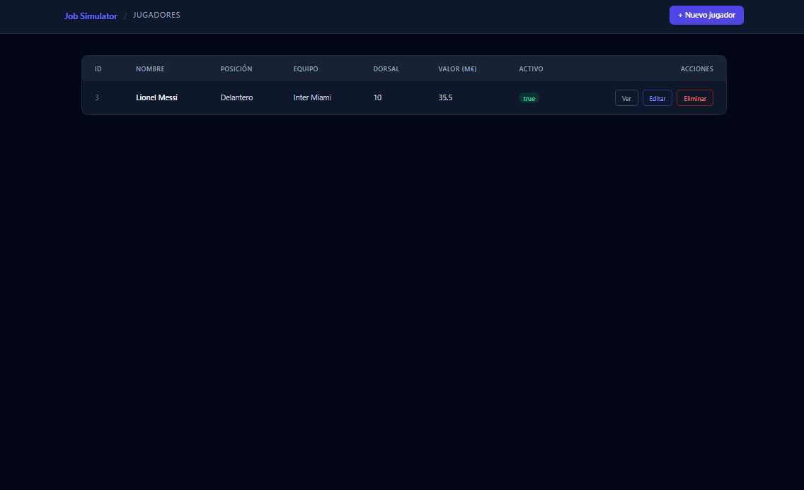
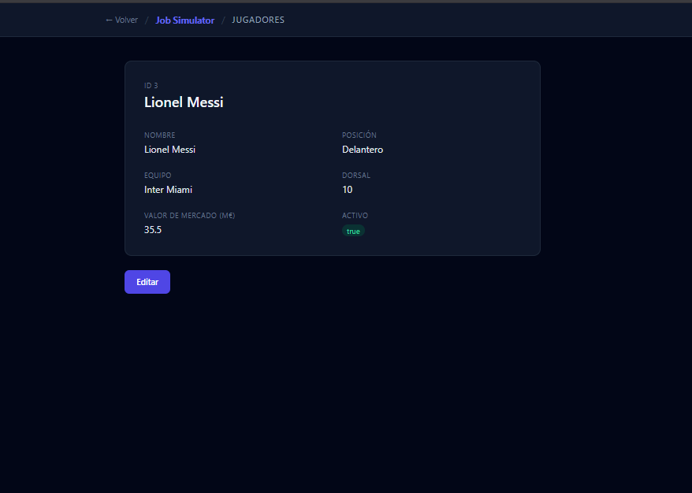
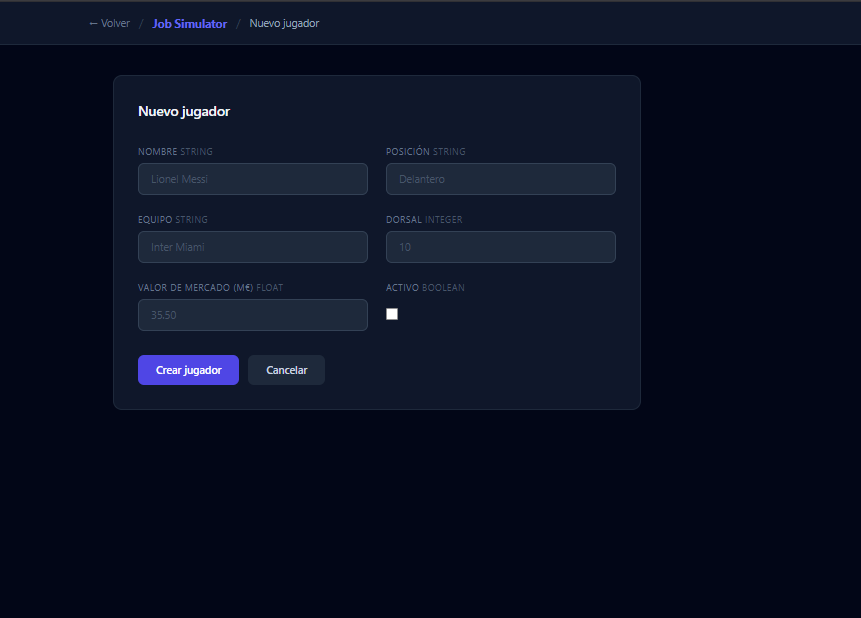
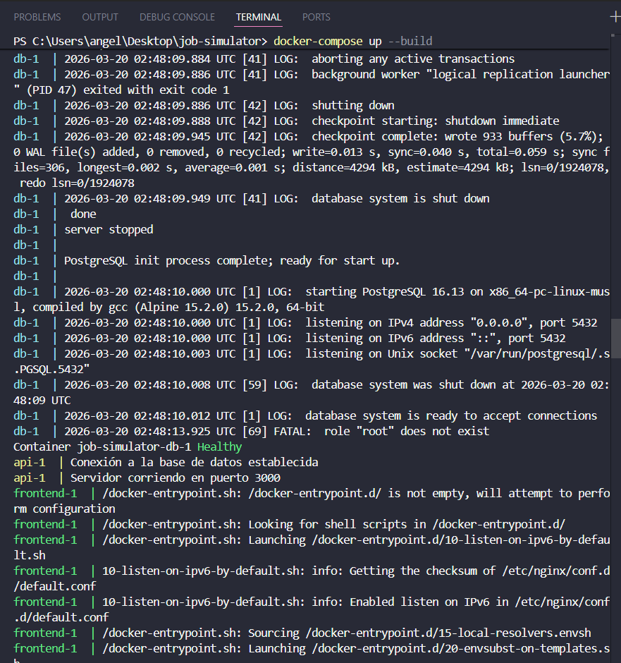
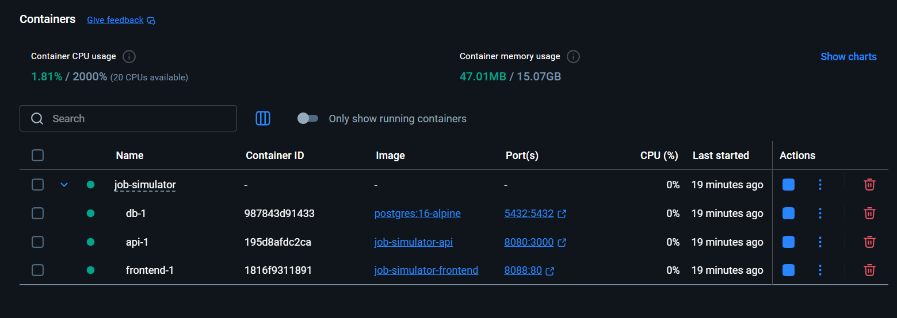

# Job Simulator — API REST Jugadores de Futbol

## Nivel de entrega: Senior (100/100) + Bonus Full Stack (+10) + Bonus Personalización (+5)

---

## Descripcion

API REST con operaciones CRUD completas para la gestión de jugadores de futbol. Construida con Express.js, PostgreSQL y Docker. Incluye validaciones con Zod, arquitectura MVC y frontend integrado.

---

## Stack

| Tecnologia       | Detalle            |
| ---------------- | ------------------ |
| Lenguaje         | JavaScript (Node.js) |
| Framework        | Express.js         |
| Base de datos    | PostgreSQL 16      |
| Validaciones     | Zod                |
| Containerización | Docker + Docker Compose |
| Frontend         | HTML + Tailwind CSS + Nginx |

---

## Como levantar el proyecto

```bash
docker-compose up --build
```

| Servicio  | URL                              |
| --------- | -------------------------------- |
| Frontend  | http://localhost:8088             |
| API       | http://localhost:8080/jugadores   |
| PostgreSQL| localhost:5432                    |

---

## Estructura del proyecto

```
job-simulator/
├── backend/
│   ├── src/
│   │   ├── config/
│   │   │   └── db.js                    # Conexion PostgreSQL
│   │   ├── schemas/
│   │   │   └── jugadorSchema.js         # Schemas Zod
│   │   ├── middlewares/
│   │   │   ├── validate.js              # Validacion de body e ID
│   │   │   └── errorHandler.js          # Manejo global de errores
│   │   ├── models/
│   │   │   └── jugadorModel.js          # Queries SQL
│   │   ├── controllers/
│   │   │   └── jugadoresController.js   # Logica de negocio
│   │   └── routes/
│   │       └── jugadores.js             # Definicion de endpoints
│   ├── init.sql                         # Script de inicializacion
│   ├── Dockerfile
│   ├── package.json
│   └── server.js                        # Punto de entrada
├── frontend/
│   ├── public/
│   ├── Dockerfile
│   └── nginx.conf
├── docker-compose.yml
├── .env
├── .env.example
└── .gitignore
```

---

## Endpoints

| Metodo | Ruta               | Descripcion              | Codigo exito | Codigo error |
| ------ | ------------------ | ------------------------ | ------------ | ------------ |
| GET    | /jugadores         | Listar todos             | 200          | —            |
| GET    | /jugadores/:id     | Obtener uno por ID       | 200          | 404          |
| POST   | /jugadores         | Crear jugador            | 201          | 400          |
| PUT    | /jugadores/:id     | Actualizar completo      | 200          | 400, 404     |
| PATCH  | /jugadores/:id     | Actualizar parcial       | 200          | 400, 404     |
| DELETE | /jugadores/:id     | Eliminar jugador         | 204          | 404          |

---

## Recurso: Jugador

| Campo API | Campo BD       | Tipo    | Descripcion          |
| --------- | -------------- | ------- | -------------------- |
| id        | id             | integer | PK, autoincrement    |
| campo1    | nombre         | string  | Nombre del jugador   |
| campo2    | posicion       | string  | Posicion en cancha   |
| campo3    | equipo         | string  | Equipo actual        |
| campo4    | dorsal         | integer | Numero de camiseta   |
| campo5    | valor_mercado  | float   | Valor en millones €  |
| campo6    | activo         | boolean | En actividad o no    |

---

## Variables de entorno

Definidas en `.env` (no versionado). Referencia en `.env.example`:

| Variable    | Descripcion                       |
| ----------- | --------------------------------- |
| DB_HOST     | Host de la base de datos          |
| DB_PORT     | Puerto de PostgreSQL              |
| DB_NAME     | Nombre de la base de datos        |
| DB_USER     | Usuario de PostgreSQL             |
| DB_PASSWORD | Contraseña de PostgreSQL          |
| APP_PORT    | Puerto interno de la aplicacion   |

---

## Capturas de funcionamiento

### Frontend







### Docker Compose



### Docker Desktop



---

## Validaciones implementadas

- Todos los campos son requeridos en POST y PUT
- PATCH requiere al menos un campo valido
- campo1, campo2, campo3: string no vacio
- campo4: entero
- campo5: numero (decimal)
- campo6: booleano
- ID en params: entero positivo
- Errores de validacion retornan 400 con array de mensajes descriptivos
- Recurso no encontrado retorna 404
- Errores internos retornan 500

---

## Requisitos Senior cumplidos

- [x] CRUD completo (GET, POST, PUT, DELETE)
- [x] Endpoint PATCH para actualizaciones parciales
- [x] PostgreSQL como base de datos relacional
- [x] docker-compose.yml con servicios separados (db + api)
- [x] Variables de entorno sin credenciales hardcodeadas
- [x] .env.example documentado
- [x] .gitignore configurado
- [x] Script SQL de inicializacion automatica
- [x] Separacion clara de responsabilidades (MVC + middlewares + schemas)
- [x] Healthcheck en PostgreSQL + retry de conexion en la app
- [x] Bonus: Frontend integrado en docker-compose
- [x] Bonus: Frontend personalizado con dominio de futbol
